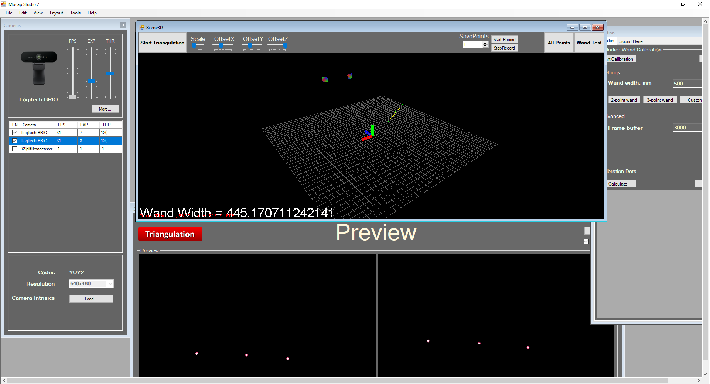
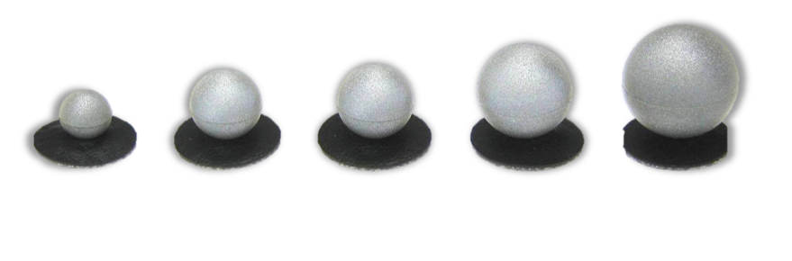
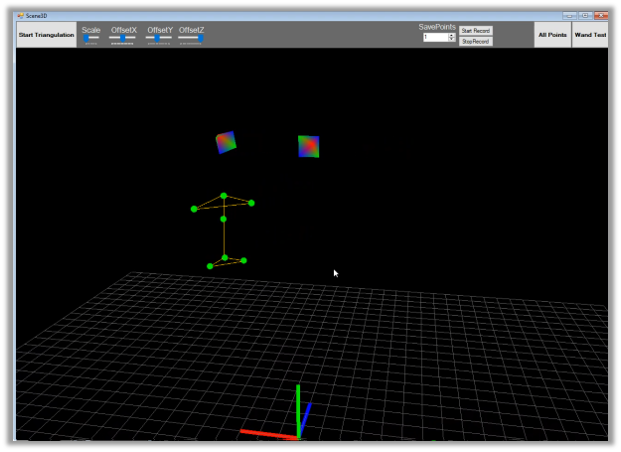

# Mocap-Studio
Motion capture studio for using with 2 web-cams

# Basic Overview

The program allows you to calibrate the motion capture system and reconstruct the markers



## Markers

Passive markers thath reflect light



## Calibration

Calibration is performed with a T-shap stick with markers at the ends


## Reconstruction

After calibration program reconstructs visible markers



# Info

For more information contact me at:
```eldarsharpey@gmail.com```

# Authors

* Eldar Shayahmetov, eldarsharpey@gmail.com
